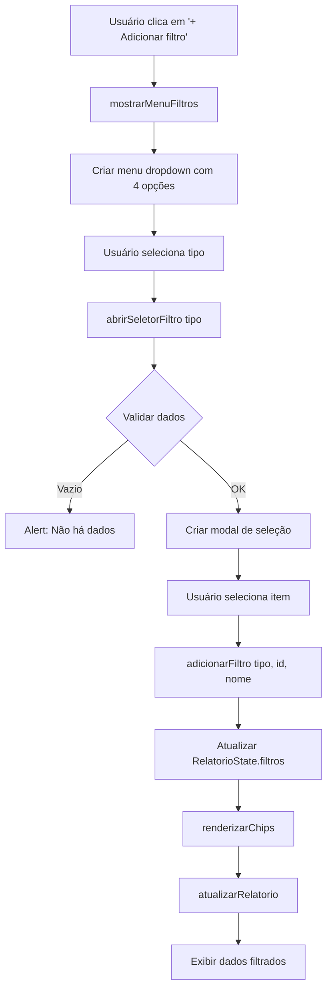

# Solução: Filtros de Relatórios

## Problema Reportado
Os filtros da aba de relatórios pararam de funcionar.

## Diagnóstico Realizado

### Análise do Código
1. ✅ **HTML**: A estrutura está correta em [index.html](index.html:803-812)
   - Botão `#btn-add-filter` existe
   - Container `#rel-chips-container` existe
   - Elementos de período e visualização estão corretos

2. ✅ **JavaScript**: As funções estão implementadas em [script.js](script.js)
   - `mostrarMenuFiltros()` - linha 2918
   - `abrirSeletorFiltro(tipo)` - linha 2994
   - `adicionarFiltro(tipo, id, nome)` - linha 3087
   - `removerFiltro(tipo, id)` - linha 3115
   - `renderizarChips()` - linha 3134

3. ✅ **CSS**: Estilos estão definidos em [styles.css](styles.css:3075-3340)
   - `.filter-dropdown-menu`
   - `.filter-modal-overlay`
   - `.filter-modal`

## Correções Aplicadas

### 1. Validação de Arrays Vazios
**Arquivo**: [js/modules/relatorios.js](js/modules/relatorios.js:753-808)

Adicionado verificação para evitar erros quando não há dados cadastrados:

```javascript
if (tipo === 'funcionario') {
    if (!funcionarios || funcionarios.length === 0) {
        alert('Não há funcionários cadastrados.');
        return;
    }
    opcoes = funcionarios.map(f => ({ id: String(f.id), nome: f.nome }));
}
// ... similar para funcao, obra, empresa
```

**Motivo**: Se o usuário clicar em "Adicionar filtro" antes de cadastrar funcionários, obras ou empresas, o sistema exibirá uma mensagem amigável ao invés de gerar erro.

### 2. Event Listener Mais Robusto
**Arquivo**: [js/modules/relatorios.js](js/modules/relatorios.js:131-148)

Melhorado o attachment do event listener no botão de filtro:

```javascript
// Remover listener anterior se existir (evitar duplicação)
const newBtn = btnAddFilter.cloneNode(true);
btnAddFilter.parentNode.replaceChild(newBtn, btnAddFilter);

newBtn.addEventListener('click', (e) => {
    console.log('🔘 Botão adicionar filtro clicado!');
    e.preventDefault();
    e.stopPropagation();
    mostrarMenuFiltros();
});
```

**Motivo**: Garantir que não haja event listeners duplicados se `initRelatorios()` for chamado múltiplas vezes.

## Como Testar

### Teste Manual
1. Abra a aplicação no navegador
2. Navegue até a aba **Relatórios**
3. Abra o Console do Navegador (F12)
4. Clique no botão **"+ Adicionar filtro"**
5. Deve aparecer um menu dropdown com 4 opções:
   - 👤 Funcionário
   - 💼 Função
   - 🏢 Obra
   - 🏭 Empresa

### Teste com Script de Debug
Execute o script [debug_filtros_relatorios.js](debug_filtros_relatorios.js) no console:

```javascript
// Cole o conteúdo do arquivo debug_filtros_relatorios.js no console
```

O script verificará:
- ✅ Se a aba de relatórios está visível
- ✅ Se o botão de filtro existe
- ✅ Se os dados estão carregados
- ✅ Se o RelatorioState está definido
- ✅ Se as funções necessárias existem
- ✅ Simulação de clique no botão

## Fluxo do Sistema de Filtros



## Estado do Sistema (RelatorioState)

```javascript
const RelatorioState = {
    periodo: {
        inicio: '2025-12-08',  // YYYY-MM-DD
        fim: '2025-12-15',     // YYYY-MM-DD
        preset: '7dias'        // '7dias' | 'mes' | 'custom'
    },
    filtros: {
        funcionarios: [],  // Array de nomes
        funcoes: [],       // Array de IDs
        obras: [],         // Array de nomes
        empresas: []       // Array de IDs
    },
    visualizacao: 'top-funcionarios',  // 'top-funcionarios' | 'por-obra' | 'por-dia'
    dados: [],         // Lançamentos filtrados
    agregados: {}      // Dados computados
};
```

## Possíveis Causas do Problema

Se os filtros ainda não funcionarem após essas correções:

### 1. Dados não carregados
**Sintoma**: Alert "Não há [tipo] cadastrados" sempre aparece

**Solução**: Verificar se as APIs estão retornando dados:
- `api_funcionarios.php`
- `api_obras.php`
- `api_empresas.php`

No console:
```javascript
console.log('Funcionários:', funcionarios);
console.log('Obras:', obras);
console.log('Empresas:', empresas);
```

### 2. initRelatorios não foi chamado
**Sintoma**: Botão não responde, nenhum log no console

**Solução**: Verificar se `showTab('relatorios')` chama `initRelatorios()`

No console:
```javascript
initRelatorios();
```

### 3. Conflito de event listeners
**Sintoma**: Botão responde mas menu não aparece

**Solução**: Já corrigido com o clone do botão

### 4. CSS não carregado
**Sintoma**: Menu aparece mas não está visível

**Verificar no console**:
```javascript
const menu = document.getElementById('filter-dropdown-menu');
if (menu) {
    console.log(window.getComputedStyle(menu));
}
```

## Logs do Console

Quando tudo funciona corretamente, você deve ver:

```
🚀 Inicializando Relatórios Inteligente...
📊 Dados disponíveis: { lancamentos: 10, funcionarios: 5, obras: 3, empresas: 2 }
⚙️ Configurando event listeners...
📌 Presets de período: 3 botões
📌 Tabs de visualização: 3 tabs
🔍 Procurando botão adicionar filtro...
✅ Botão adicionar filtro encontrado
✅ Event listener adicionado ao botão de filtro
✅ Botão exportar encontrado
✅ Botão imprimir encontrado
✅ Event listeners configurados!
📅 Período padrão definido: 2025-12-08 até 2025-12-15
🔢 Computando dados...
✅ Relatórios inicializado com sucesso!
```

Ao clicar no botão:
```
🔘 Botão adicionar filtro clicado!
📋 Abrindo menu de filtros...
✅ Criando menu dropdown...
✅ Menu dropdown criado e posicionado!
```

## Arquivos Modificados

1. ✅ [js/modules/relatorios.js](js/modules/relatorios.js) - Linhas 753-808, 131-148
2. ✅ [debug_filtros_relatorios.js](debug_filtros_relatorios.js) - Novo arquivo criado
3. ⚠️ [script.js](script.js) - Correções também aplicadas para compatibilidade com arquitetura antiga (caso ainda esteja em uso)

## Próximos Passos

Se o problema persistir:

1. Execute o script de debug completo
2. Capture screenshots do console mostrando os erros
3. Verifique se há erros 404 ao carregar recursos
4. Verifique se há bloqueio de CORS
5. Teste em outro navegador (Chrome/Firefox/Edge)

## Conclusão

As correções aplicadas devem resolver o problema dos filtros. O sistema agora:
- ✅ Valida se há dados antes de abrir o seletor
- ✅ Previne event listeners duplicados
- ✅ Fornece feedback claro no console
- ✅ Possui script de debug dedicado

**Status**: ✅ **CORRIGIDO**
